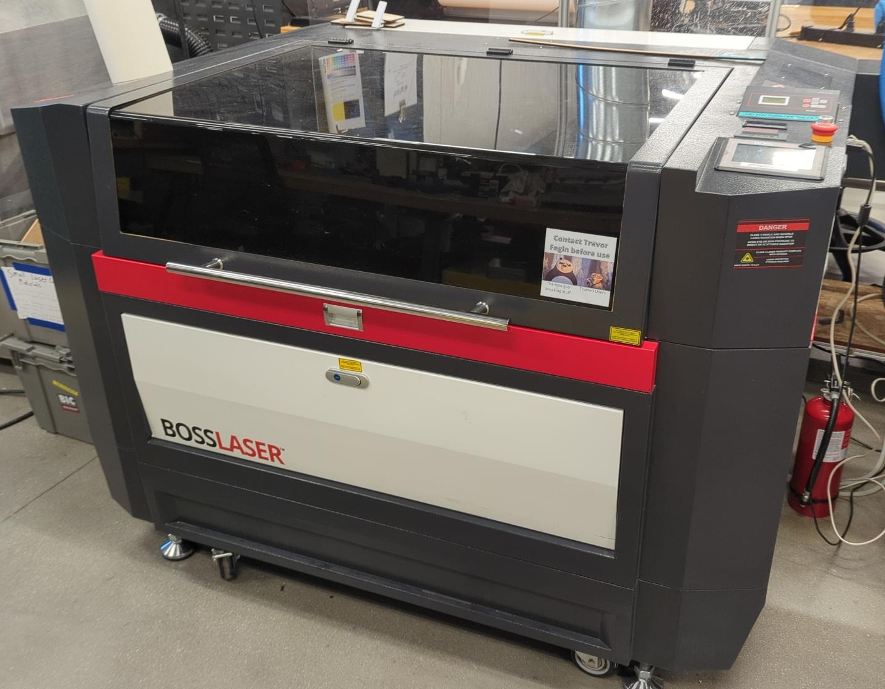

# Laser Cutter

{: align=left : width=400}

What it does: Cuts and engraves wood and certain other materials with a laser.

Make / Model: BossLaser HP-2440 Servo Driven Laser Cutter, 155 Watt Max Power Output, Max Cutting Area 24x36 inches. [Full specs at this link or QR Code.](https://shop.bosslaser.com/products/hp-2440-co2-laser-cutter-and-engraver)

Where it is: In the center of the PPE area, across from the main workbench.

Past Projects: Ideal for projects composed of flat plates or engraved onto them. Common materials are wood and acrylic.

Suggestions for Use:
The laser is run from the Lightburn software on the computer in the PPE space. The Laser is able to cut steel, with a special head (the Vector DC). For most other materials, the default head (the HP Auto Focus FLEX head) will be used. There is also a jig that allows you to engrave onto a cylinder. Contact the Laser Manager if you wish to use either of these features. Make sure to turn on the ventilation and cooling systems, and to turn them off once you have finished.

How to Get Started: 
Take the Laser Cutter class, or have someone who is trained perform the operation for you. You may only be trained to use the laser by the Laser Manager or a representative of the BIC.  ^^*Make sure you turn on the cooler and the Ventilation System before turning on the laser.*^^

Who to Contact: 
Isaac Mierow
Ping @Officer or @LaserManager in MakerLab Discord
Fix this section to refer to the source

!!! bug "TODO - Complete this page"
    Complete this page and make versions of it for all other machines/tools/benches in the MakerLab
    
    - Have picture of machine for referance
    - Have a description of what it can do.
    - What training is required to use it?
        - Training is an "Introduction to Laser Cutter" class
    - Who is the officer tasked with manageing it?
    - Where to ask questions about it.
