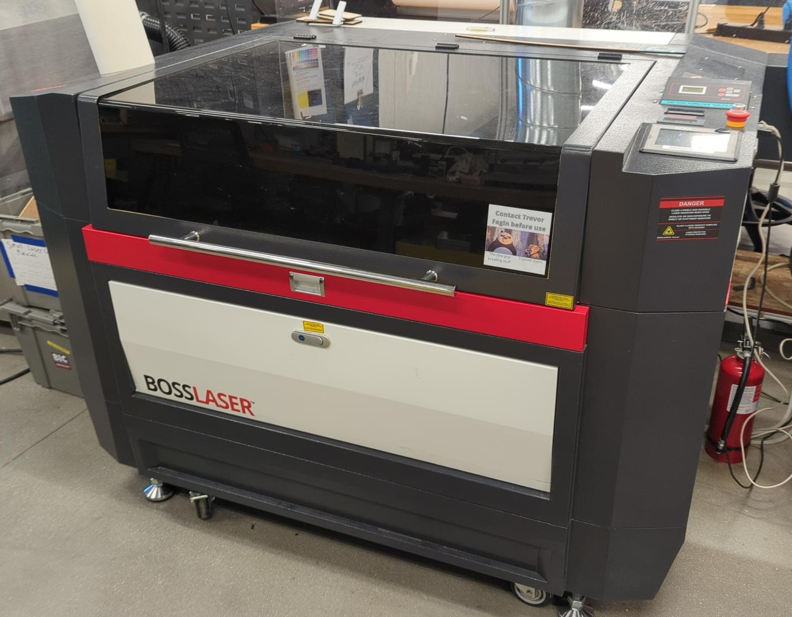

# Laser Cutter

{: align=right : width=400}

A BossLaser HP-2440 CO~2~ laser used for cutting and engraving mostly flat materials (wood, acrylic, etc.). This machine is self-service and meant to be operated by Trained MakerLab There is a cylinder jig for etching cylindrical objects.

^^**Specs:**^^ 
- 155 Watt CO~2~ Laser
- 24 × 36 inch cutting area 
- [Full specs here.](https://shop.bosslaser.com/products/hp-2440-co2-laser-cutter-and-engraver)

^^**Location:**^^ Center of the PPE area, across from the main workbench.

^^**Relevant Officer:**^^ [Laser Manager](../current_officers.md#officers)

## Capabilities

- Cut & Engrave Flat Materials including wood and acrylic
- Engrave Cylindrical Materials (Contact Officer)
- Cut Thin Metal (Not offered because it is a signifigant inconvenience)
- Cut & Engrave Thin Materials with Honeycomb bed (Contact Officer)
- Mark Metals using laser marking spray (Contact Officer)

## Getting  Started

Take The Required Class(s):

- [Intro To Laser Cutting](../Classes/required_training.md#intro-to-laser-cutting)

Contact the [Laser Officer](../current_officers.md#officers) if you need further assistance.

## Related Classes

Below is a list of classes that relate to the laser cutter, some of which are necessary to be allowed to use the laser cutter. It also describes the general type of class that it is, including training classes that show you how to use the machine and project-based classes that use the machine to create a project. If you have any issues, contact a [MakerLab Officer](../current_officers.md#current-officers).

| Class Name | Required? | Type | Purpuse |
| :--------- | :-------: | :--: | :------ |
| [Intro To Laser Cutting](../Classes/required_training.md#intro-to-laser-cutting)  | Yes | Training | Allows you to use the Laser Cutter |
| [Message Laser Officer](../current_officers.md#officers)                          | No  | Any      | Assistance on niche projects or advanced capabilities |

## Documentation

### MakerLab Docs
The following docs are hosted on MakerLab's Discord server on a channel you will only have access to once you are trained to use the Laser Cutter.

[Laser Cutter Documentation](https://discord.com/channels/639225419639291914/639894435844325418/1436578282773545011){  .md-button .md-button--primary }

[Allowed Materials](https://discord.com/channels/639225419639291914/639894435844325418/1436089063554941079){  .md-button .md-button--seccondary }

### Lightburn Docs
[Lightburn Documentation](https://docs.lightburnsoftware.com/latest/Reference/){  .md-button .md-button--primary }

### Lasercutter Docs
[All HP-2440 Documentation](https://bosslaser.com/resources/?_keyword_search=hp%20series&_resources_category=manuals-and-guides){ .md-button .md-button--primary }

[Quick Start Guide](https://bosslaser.com/wp-content/uploads/2024/06/QM-855-916-Quick-Start-Guide-HP-Machines.pdf){  .md-button .md-button--seccondary }
[User Manual](https://bosslaser.com/wp-content/uploads/2024/06/hp-series-user-manual.pdf){  .md-button .md-button--seccondary }

## Past Projects

Add this later.