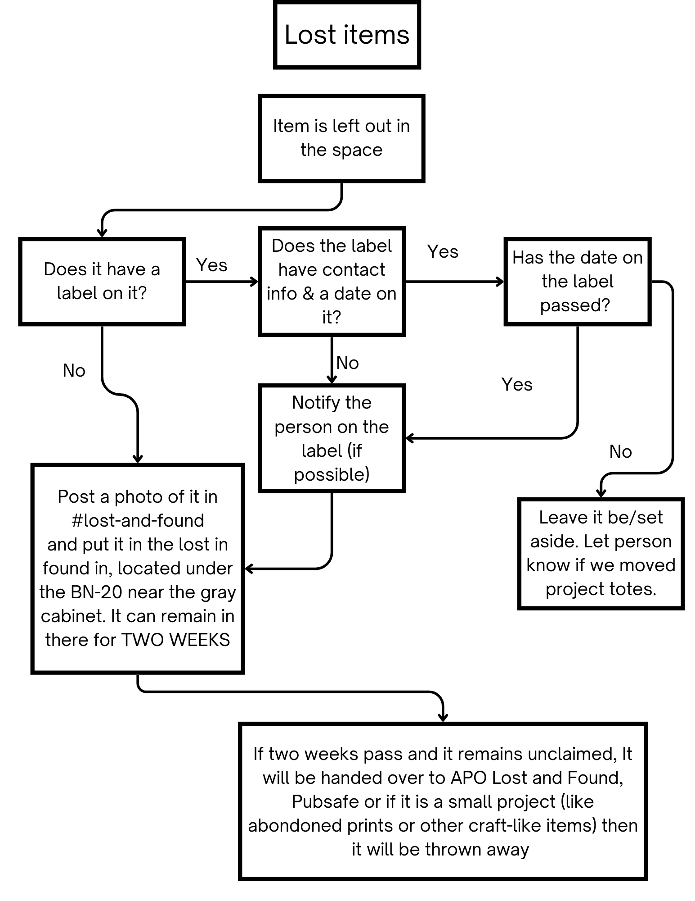

# Lost & Found Policy

Use the slips provided in MakerLab.

??? note "Background Information"
    **Authority:** MakerLab Officers

!!! bug "TODO - Fill Out Page"
    - Add the diagram to this page using mermaid
    - Port the procedure from the sign in MakerLab
    - Add a link to the document that can be printed to allow makers to refill it if it is empty.