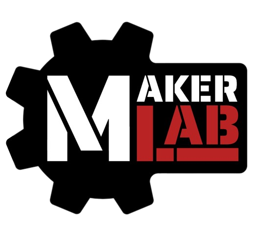

# MakerLab Overview

{: align=right : width=400}

## What is the MakerLab?
MakerLab is a BIC team that provides tools and a work area in the KIC to enable the creation of Rose-Hulman students' personal projects. We are located just past the KIC's front doors to the immediate right. We are a distinct group from Kic3D and the BIC/KIC.

## Gaining Access to the MakerLab

For an overview of classes, [look here](./Classes/required_training.md) but this is a good general overview:

1. Take the BIC/KIC access quizzes on Moodle
    - Take the Online Training only takes 1-2 hrs and is found [by following this link](https://moodle.rose-hulman.edu/course/view.php?id=118553#).
    - For the final group selection step, say that you are a member of the `MakerLab` team.
2. Join the [MakerLab Discord](get_connected.md#join-discord).
3. Take a Welcome To MakerLab Class offered by MakerLab
    - [Information on how MakerLab classes are run](./Classes/index.md)

!!! bug "TODO - Add additional details"
    This section should be fool-proof and easy to follow along with, including links to necessary cites and images of where to click to get where you need to go.
